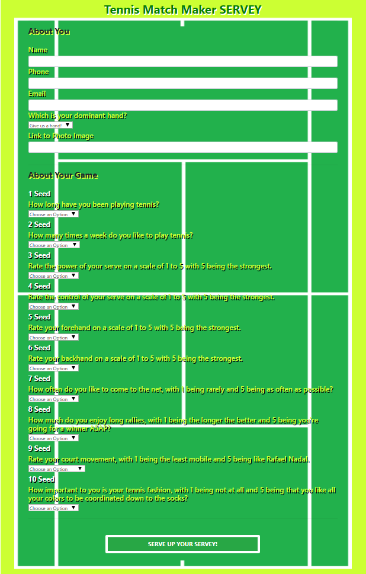
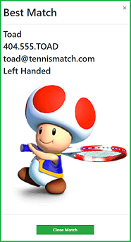

# Tennis Match Maker

## About

**Tennis Match Maker (TMM)** is a **Node** and **Express** powered full stack match making website deployed via **Heroku** designed to help a tennis player find their perfect match!  A prospective player simply provides bio info and an assessment of their game and **Tennis Match Maker** does the rest!

## How it Works
 
A tennis player new to **TMM** will begin the experience by clicking the button on the site home screen to complete a _Servey_, **TMM's** tennis centric survey. 

The _Servey_ is broken up into 2 sections.  The first captures the player's bio and contact info, while the second is a 10 question self-assessment of the player's game to help identify the best match from within the site's _API Players List_. 

Once the survey has been completed, the player serves it up so that **TMM** can analyze the input and identify the player's best match from the site's _API Players List_.

**TMM** returns the best match in a modal that displays the matched player's name, contact information, dominant hand, and then a picture of the match so that the player can size them up!  Toad is tough but I think we can take him!

The player is also added to the _API Players List_ so that future users can be matched to them if they are the perfect match!

It's that easy!

## Give it a SHOT!

https://tennis-match-finder.herokuapp.com/

## Under the Hood: Heroku Repo

https://dashboard.heroku.com/apps/tennis-match-finder

